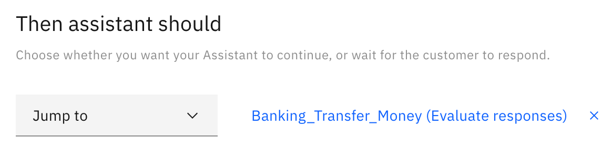
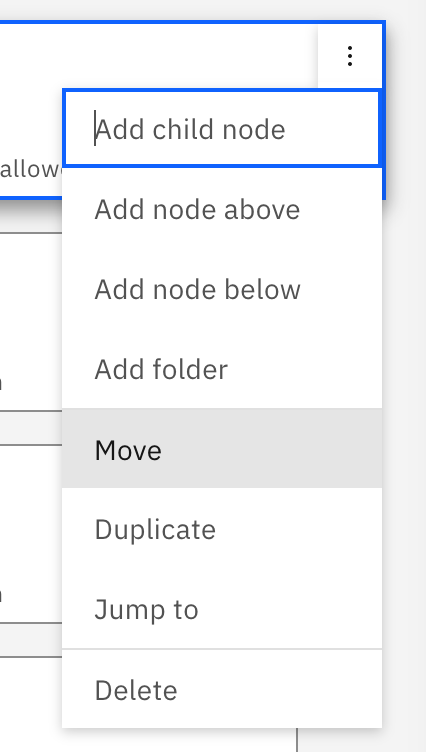
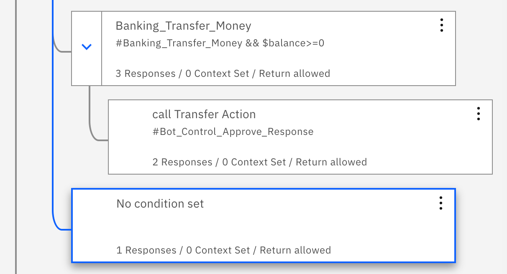
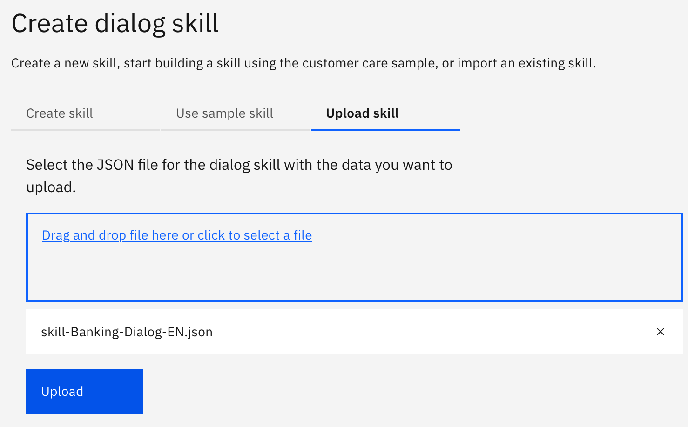
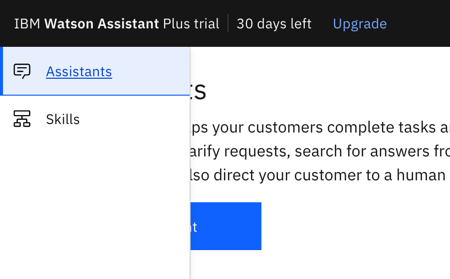
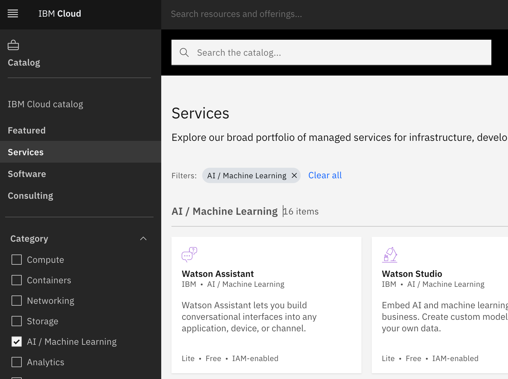
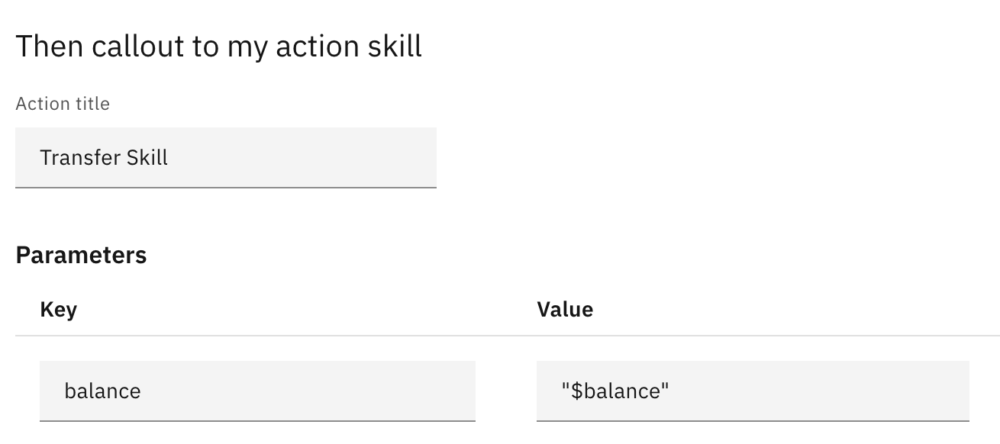
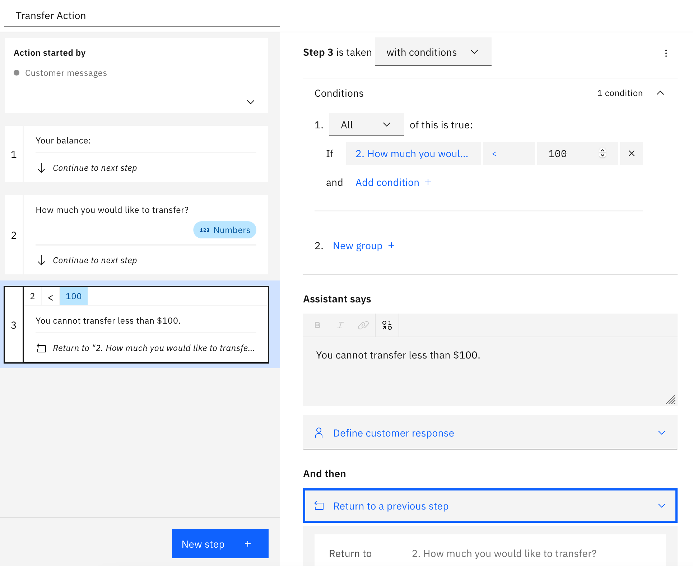

# Lab 1. Watson Assistant Acxtions Skills lab

Table of Contents
=================

   * [Lab 1. Watson Assistant and Watson Visual Recognition integration with messenger (Telegram) via Node-red](#lab-1-watson-assistant-and-watson-visual-recognition-integration-with-messenger-telegram-via-node-red)
   * [Table of Contents](#table-of-contents)
      * [1. Understand your default region](#1-understand-your-default-region)
      * [2. Node-red installation](#2-node-red-installation)
      * [3. Watson Services configuration](#3-watson-services-configuration)
         * [3.1. IBM Watson Assistant](#31-ibm-watson-assistant)
         * [3.2. IBM Watson Visual Recognition](#32-ibm-watson-visual-recognition)
         * [3.3. IBM Language Translator (optional)](#33-ibm-language-translator-optional)
      * [4. Create Telegram-bot](#4-create-telegram-bot)
      * [5. Configure Node-RED](#5-configure-node-red)
      * [5.1. Import example flow configuration](#51-import-example-flow-configuration)
      * [5.2. Add Telegram controls to Node-RED](#52-add-telegram-controls-to-node-red)
      * [5.3. Configure Telegram in Node-RED](#53-configure-telegram-in-node-red)
      * [5.4. Configure connection to IBM Watson Assistant in Node-RED](#54-configure-connection-to-ibm-watson-assistant-in-node-red)
      * [5.5. Configure connection to Watson Visual Recognition in Node-RED](#55-configure-connection-to-watson-visual-recognition-in-node-red)
      * [6. Test your bot](#6-test-your-bot)

			# Lab 1 - Action skill for Watson Assistant

			1.1. Go to cloud.ibm.com. Create a new Watson Assistant instance.

			1.2. ывавыаца

			<!-- Copy and paste the converted output. -->

			<!-----
			NEW: Check the "Suppress top comment" option to remove this info from the output.

			Conversion time: 1.347 seconds.

			Using this Markdown file:

			1. Paste this output into your source file.
			2. See the notes and action items below regarding this conversion run.
			3. Check the rendered output (headings, lists, code blocks, tables) for proper
			   formatting and use a linkchecker before you publish this page.

			Conversion notes:

			* Docs to Markdown version 1.0β29
			* Mon Jan 25 2021 05:29:15 GMT-0800 (PST)
			* Source doc: workshop
			* This document has images: check for >>>>>  gd2md-html alert:  inline image link in generated source and store images to your server. NOTE: Images in exported zip file from Google Docs may not appear in  the same order as they do in your doc. Please check the images!

			----->

			
>>>>>  gd2md-html alert:  ERRORs: 0; WARNINGs: 0; ALERTS: 8.

			<ul style="color: red; font-weight: bold"><li>See top comment block for details on ERRORs and WARNINGs. <li>In the converted Markdown or HTML, search for inline alerts that start with >>>>>  gd2md-html alert:  for specific instances that need correction.</ul>

			
Links to alert messages:
<a href="#gdcalert1">alert1</a>
			<a href="#gdcalert2">alert2</a>
			<a href="#gdcalert3">alert3</a>
			<a href="#gdcalert4">alert4</a>
			<a href="#gdcalert5">alert5</a>
			<a href="#gdcalert6">alert6</a>
			<a href="#gdcalert7">alert7</a>
			<a href="#gdcalert8">alert8</a>

			
>>>>> PLEASE check and correct alert issues and delete this message and the inline alerts.

			DIALOG:

			
>>>>>  gd2md-html alert: inline image link here (to images/image1.png). Store image on your image server and adjust path/filename/extension if necessary.  (<a href="#">Back to top</a>)(<a href="#gdcalert2">Next alert</a>) >>>>> 

			

			
>>>>>  gd2md-html alert: inline image link here (to images/image2.png). Store image on your image server and adjust path/filename/extension if necessary.  (<a href="#">Back to top</a>)(<a href="#gdcalert3">Next alert</a>) >>>>> 

			

			Transfer Action:

			
>>>>>  gd2md-html alert: inline image link here (to images/image3.png). Store image on your image server and adjust path/filename/extension if necessary.  (<a href="#">Back to top</a>)(<a href="#gdcalert4">Next alert</a>) >>>>> 

			

			
>>>>>  gd2md-html alert: inline image link here (to images/image4.png). Store image on your image server and adjust path/filename/extension if necessary.  (<a href="#">Back to top</a>)(<a href="#gdcalert5">Next alert</a>) >>>>> 

			

			Retrieve user's balance

			
>>>>>  gd2md-html alert: inline image link here (to images/image5.png). Store image on your image server and adjust path/filename/extension if necessary.  (<a href="#">Back to top</a>)(<a href="#gdcalert6">Next alert</a>) >>>>> 

			

			webhook.site:

			$request.content$

			{ "balance": 123000 }

			Transfer Action:

			
>>>>>  gd2md-html alert: inline image link here (to images/image6.png). Store image on your image server and adjust path/filename/extension if necessary.  (<a href="#">Back to top</a>)(<a href="#gdcalert7">Next alert</a>) >>>>> 

			

			
>>>>>  gd2md-html alert: inline image link here (to images/image7.png). Store image on your image server and adjust path/filename/extension if necessary.  (<a href="#">Back to top</a>)(<a href="#gdcalert8">Next alert</a>) >>>>> 

			

			
>>>>>  gd2md-html alert: inline image link here (to images/image8.png). Store image on your image server and adjust path/filename/extension if necessary.  (<a href="#">Back to top</a>)(<a href="#gdcalert9">Next alert</a>) >>>>> 

			
