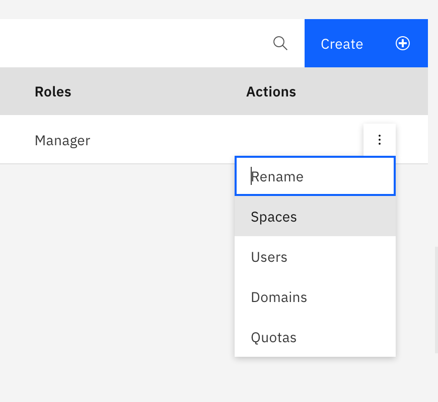
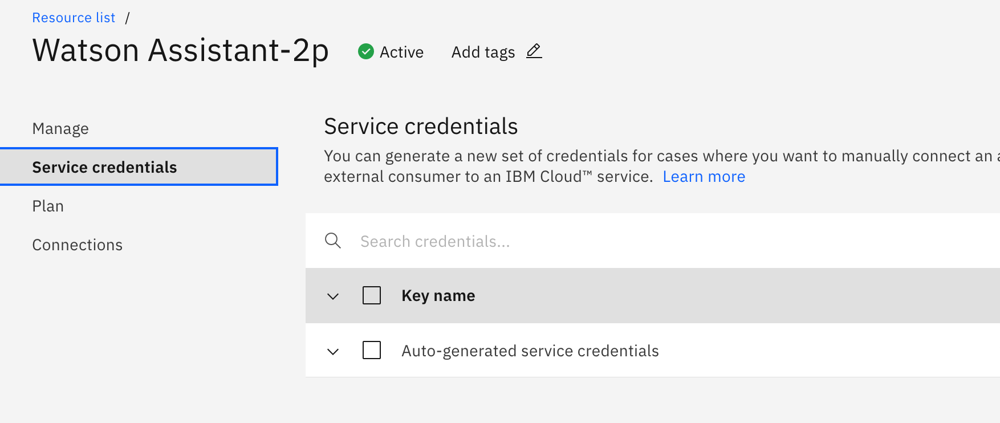
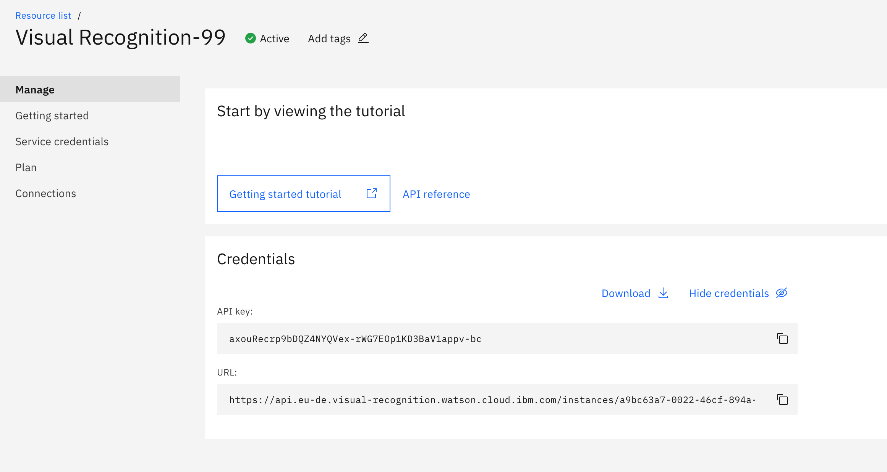
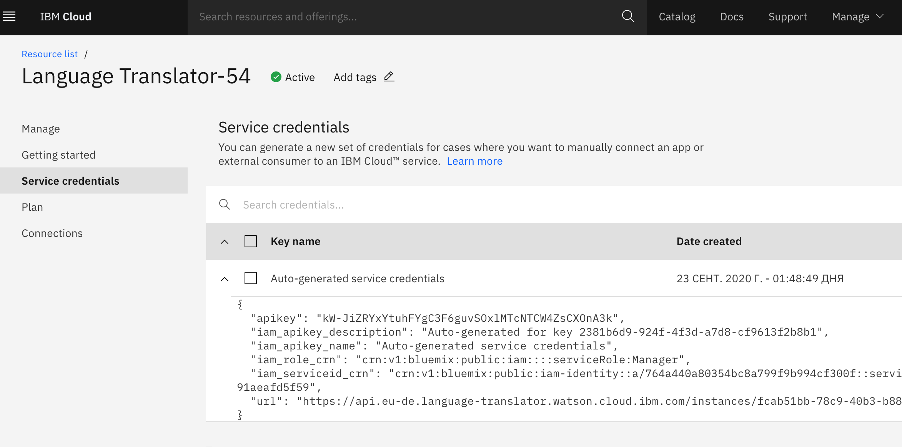
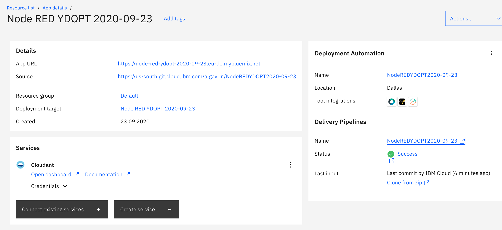
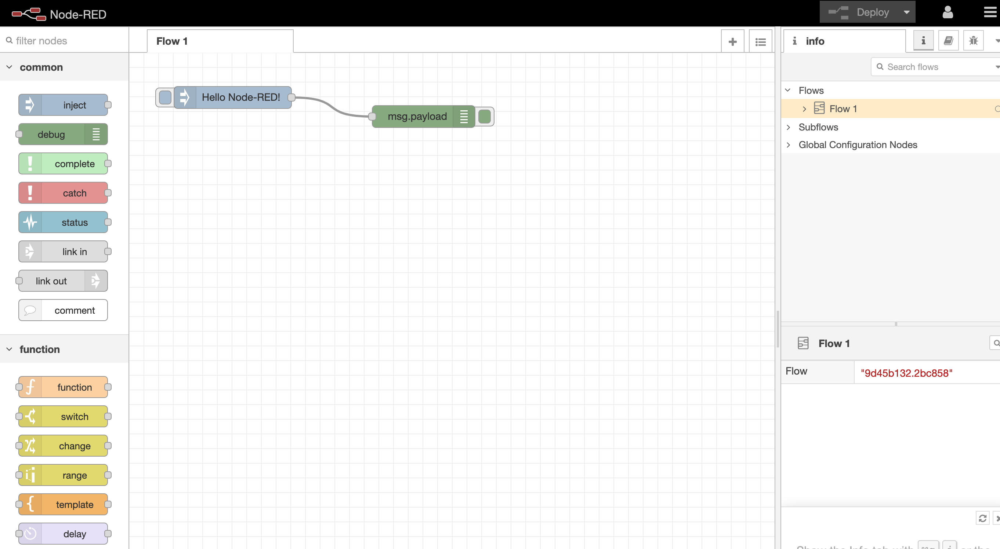

# Lab 1. Watson Assistant and Telegram integration via Node-red

* [Lab 1. Watson Assistant and Telegram integration via Node-red](#lab-1-watson-assistant-and-telegram-integration-via-node-red)
		* [1. Understand your default region](#1-understand-your-default-region)
		* [2. Node-red installation](#2-node-red-installation)
		* [3. Watson Services configuration](#3-watson-services-configuration)
			 * [3.1. IBM Watson Assistant](#31-ibm-watson-assistant)
			 * [2.2. IBM Watson Visual Recognition](#22-ibm-watson-visual-recognition)
			 * [2.3. IBM Language Translator (optional)](#23-ibm-language-translator-optional)
		* [3. Create Telegram-bot](#3-create-telegram-bot)
		* [4. Configure Node-RED](#4-configure-node-red)
		* [4.1. Start Node-RED](#41-start-node-red)
		* [4.2. Import configuration](#42-import-configuration)
		* [4.3. Add Telegram controls to Node-RED](#43-add-telegram-controls-to-node-red)
		* [4.4. Configure Telegram in Node-RED](#44-configure-telegram-in-node-red)
		* [4.5. Configure connection to IBM Watson Assistant in Node-RED](#45-configure-connection-to-ibm-watson-assistant-in-node-red)
		* [4.6. Configure connection to Watson Visual Recognition in Node-RED](#46-configure-connection-to-watson-visual-recognition-in-node-red)
		* [5. Test your bot](#5-test-your-bot)

## 1. Understand your default region
- Login to https://cloud.ibm.com
- Go to **Manage - Account - Cloud Foundry orgs**
- You should see your default organization. Click on the actions icon on the right, and select "Spaces":

- You should now see your default region (i.e. **United Kingdom**). Use this region as your default for all your services below.
Your lite account will **not** allow to create services in multiple regions, unless you apply a promo code to your account requested at https://ibm.biz/ibmcloudcoupon

## 2. Node-red installation

- Follow the steps at https://developer.ibm.com/components/node-red/tutorials/how-to-create-a-node-red-starter-application/ to install node-red in your account. Note that you should use your default region (step 1) to install it.

## 3. Watson Services configuration
We will need to have the following services installed:
- IBM Watson Assistant
- IBM Watson Visual Recognition

### 3.1. IBM Watson Assistant
- Download watson pizzeria bot example: <a href="https://raw.githubusercontent.com/agavrin/WatsonAssistantEng/master/files/watson-pizzeria.json">watson-pizzeria.json</a>

- Create a new instance or open an existing instance of IBM Watson Assistant service

- Go to your WA instance, and click on the Service credentials tab. Make a note of key and

- Import pizza bot into a skill by going to **Skills - Create Skill - Dialog Skill - Next - Import skill - Choose JSON File**.

### 2.2. IBM Watson Visual Recognition
- Enter IBM cloud catalog
https://cloud.ibm.com/catalog

- Select **Services** - AI / Machine learning - **Visual Recognition**

- Click Create.

- Go into the "Manage" tab and save API Key and URL.

### 2.3. IBM Language Translator (optional)
- Enter IBM cloud catalog
https://cloud.ibm.com/catalog

- Select **Services** - AI / Machine learning - **Lanuage Translator**

- Click Create.

- Go into the **Service credentials** tab and save API Key and URL.

## 3. Create Telegram-bot
To create a bot:
- open Telegram appliccation and look for **BotFather** id. Send "/newbot" command to BotFather.
- you need to enter your bot name and send it to BotFather. At the end - you will get a token - that will be your key to access your bot. Save your key (you  maysend it to your email as an example) - you will need it for configuration later.

## 4. Configure Node-RED

## 4.1. Start Node-RED

Go to IBM Cloud resources dashboard:
https://cloud.ibm.com/resources
Look up your Node-RED instance, created at step 2. Click on it.

- Click on **App URL**
- You should go through the process of initial setup of node red. Enter userid and password to configure your instance later.
- Click Next - Next - Finish.
-  You will see your Node-RED flow editor

## 4.2. Import configuration

Download configuration:
<a href="//raw.githubusercontent.com/agavrin/WatsonAssistantEng/master/files/NodeRed-WatsonAssistantFlow.js">here</a>

Go to Node-RED configuration, click on the right hamburger menu, then **Import** - **select a file**

Impiort configuration, you may see import error, complaining about missing telegram controls. Let's import those:

## 4.3. Add Telegram controls to Node-RED
- Go to Manage Palette - Install
- Enter "telegram" into the search field

Select **node-red-contrib-telegrambot** and click Install

At the end you will see telegram bot nodes at the left panel.

## 4.4. Configure Telegram in Node-RED

Click on Telegram Receiver. Click the  edit pencil icon and enter API Token:

Do the same for Telegram Sender, click Update and Deploy (right top corner).

## 4.5. Configure connection to IBM Watson Assistant in Node-RED

Click Watson Assistant

You have to enter:
- Username
- Password
- Workspace ID

- Check gateway - it has to match the  one from the services
- Click Done

## 4.6. Configure connection to Watson Visual Recognition in Node-RED

Click Watson Visual Recognition

You have to enter:
- API Key

Choose appropriate endpoint (from service configuration)

Click Done

## 5. Test your bot

Try to enter your question in telegram.

As an example:
"I am hungry"
"I would like large "

Send some photo of some object. Watson  will recognize it and will return it's name.
