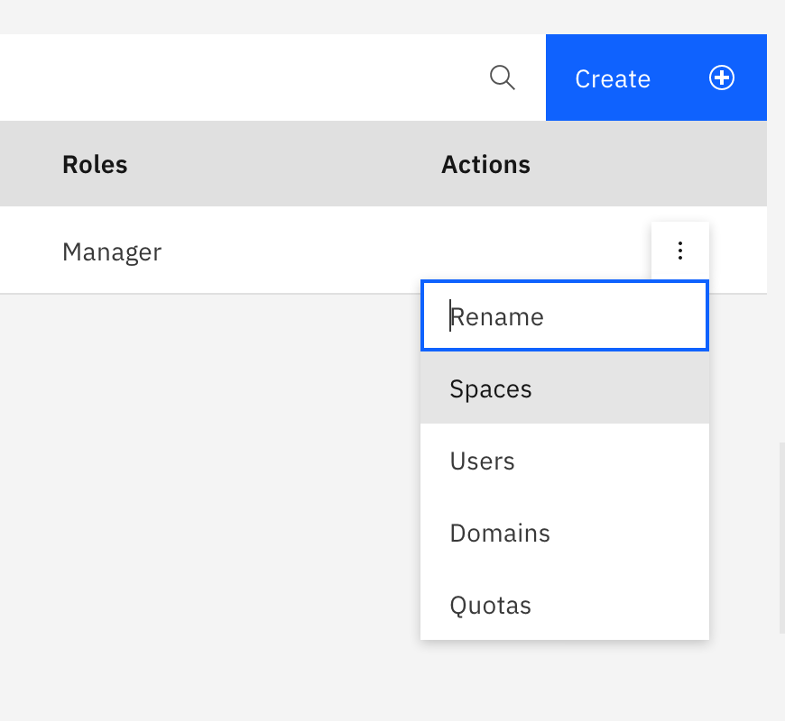
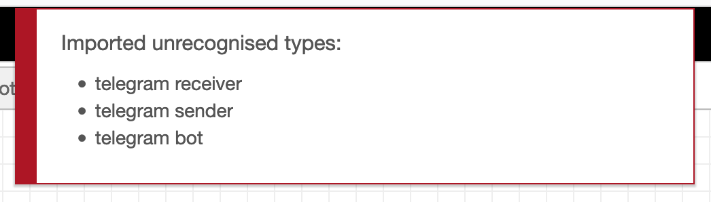
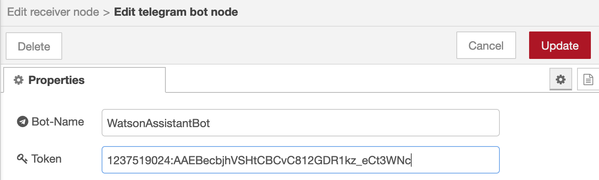
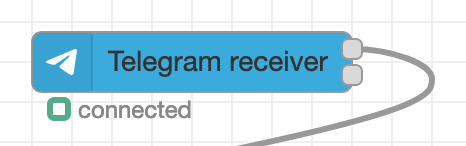

# Lab 2. Watson Assistant and Watson Visual Recognition integration with messenger (Telegram) via Node-red

Table of Contents
=================

   * [Lab 1. Watson Assistant and Watson Visual Recognition integration with messenger (Telegram) via Node-red](#lab-1-watson-assistant-and-watson-visual-recognition-integration-with-messenger-telegram-via-node-red)
   * [Table of Contents](#table-of-contents)
      * [1. Understand your default region](#1-understand-your-default-region)
      * [2. Node-red installation](#2-node-red-installation)
      * [3. Watson Services configuration](#3-watson-services-configuration)
         * [3.1. IBM Watson Assistant](#31-ibm-watson-assistant)
         * [3.2. IBM Watson Visual Recognition](#32-ibm-watson-visual-recognition)
         * [3.3. IBM Language Translator (optional)](#33-ibm-language-translator-optional)
      * [4. Create Telegram-bot](#4-create-telegram-bot)
      * [5. Configure Node-RED](#5-configure-node-red)
      * [5.1. Import example flow configuration](#51-import-example-flow-configuration)
      * [5.2. Add Telegram controls to Node-RED](#52-add-telegram-controls-to-node-red)
      * [5.3. Configure Telegram in Node-RED](#53-configure-telegram-in-node-red)
      * [5.4. Configure connection to IBM Watson Assistant in Node-RED](#54-configure-connection-to-ibm-watson-assistant-in-node-red)
      * [5.5. Configure connection to Watson Visual Recognition in Node-RED](#55-configure-connection-to-watson-visual-recognition-in-node-red)
      * [6. Test your bot](#6-test-your-bot)

## 1. Understand your default region
- Login with your IBM id at https://cloud.ibm.com (if you do not have an id yet, register for free at https://cloud.ibm.com/registration)
- Go to **Manage - Account - Cloud Foundry orgs**
- You should see your default organisation. Click on the actions icon on the right, and select "Spaces":

- You should now see your default region (i.e. **United Kingdom**). Use this region as your default for all next steps below.
Your lite account will **not** allow to create services in multiple regions, unless you apply a promo code to your account requested at https://ibm.biz/ibmcloudcoupon

## 2. Node-red installation

- Follow the steps at https://developer.ibm.com/components/node-red/tutorials/how-to-create-a-node-red-starter-application/ to install node-red in your account (you need to execute **steps 1-5** in the guide). Note that you should use your default region (identified at [step 1](#1-understand-your-default-region)) to install it.

## 3. Watson Services configuration
We will need to have the following services installed:
- IBM Watson Assistant
- IBM Watson Visual Recognition

### 3.1. IBM Watson Assistant
- Download watson pizzeria bot example (right-click at the link and save it as **watson-pizzeria.json**): <a href="https://raw.githubusercontent.com/agavrin/WatsonAssistantEng/master/files/watson-pizzeria.json">watson-pizzeria.json</a>

- Create a new instance or open an existing instance of IBM Watson Assistant service

- Go into your assistant configuration (**Launch Watson Assistant** button) and go to three-buttons menu on the right for your "My first assistant", select Settings, then go to **API Details** - you will see your **Assistant ID** and **API key** -  make a note of those, we will need them later.
Also copy over the **Assistant URL** - the domain part only - i.e. https://api.eu-de.assistant.watson.cloud.ibm.com/ - this will also be needed later.

- Import pizza bot into a skill by going to **Manage - Launch  Watson Assistant - Skills - Create Skill - Dialog Skill - Next - Import skill - Choose JSON File - Import**.

### 3.2. IBM Watson Visual Recognition
- Enter IBM cloud catalog
https://cloud.ibm.com/catalog

- Select **Services** - AI / Machine learning - **Visual Recognition**

- Click Create.

- Go into the "Manage" tab and save **API Key** and **URL** (only the domain part, i.e. https://api.eu-de.visual-recognition.watson.cloud.ibm.com/).

### 3.3. IBM Language Translator (optional)
- Enter IBM cloud catalog
https://cloud.ibm.com/catalog

- Select **Services** - AI / Machine learning - **Lanuage Translator**

- Click Create.

- Go into the **Service credentials** tab and save API Key and URL.

## 4. Create Telegram-bot
To create a bot:
- open Telegram application and chat with **BotFather**. Send "/newbot" command to BotFather.

- follow BotFather's prompt - you will need to provide your bot's name and username in the dialog. At the end - you will get a token - that will be your key to access your bot. Save your key (you  may send it to your email as an example) - you will need it for configuration later.

## 5. Configure Node-RED

## 5.1. Import example flow configuration

- Download Node-RED flow configuration (right-click at the link and save link as **WatsonAssistantFlow.json**):
<a href="//raw.githubusercontent.com/agavrin/WatsonAssistantEng/master/files/NodeRed-WatsonAssistantFlow.json">here</a>

- Go to your Node-RED (installed at step 2), click on the right hamburger menu, then **Import** - **select a file**

- After you import configuration, you will most likely see import error, complaining about missing telegram controls. Do not worry - we will fix it at the next step. Let's import those.

## 5.2. Add Telegram controls to Node-RED
- Go to Manage Palette - Install
- Enter "telegram" into the search field
- Select **node-red-contrib-telegrambot** and click Install
- At the end you will see telegram bot nodes at the left panel.

## 5.3. Configure Telegram in Node-RED

- Click on Telegram Receiver. Click the edit pencil icon and enter bot name and API Token (which you previously received from BotFather):

- Assign the same bot to Telegram Sender, click Update and Deploy (right top corner). You should now see green "connected" icons for both telegram receiver and sender nodes:

## 5.4. Configure connection to IBM Watson Assistant in Node-RED

Click Watson Assistant

You have to enter:
- API key
- Service Endpoint
- Assistant ID
- Click Done

## 5.5. Configure connection to Watson Visual Recognition in Node-RED

Click Watson Visual Recognition

You have to enter:
- API Key
- Service endpoint

Click Done

## 6. Test your bot

Try to enter your question in telegram.

As an example:
- "I am hungry"
- "I would like large vegetarian pizza with mushrooms and olives"

Send some photo of some object. Watson will recognize it and will return it's name.
