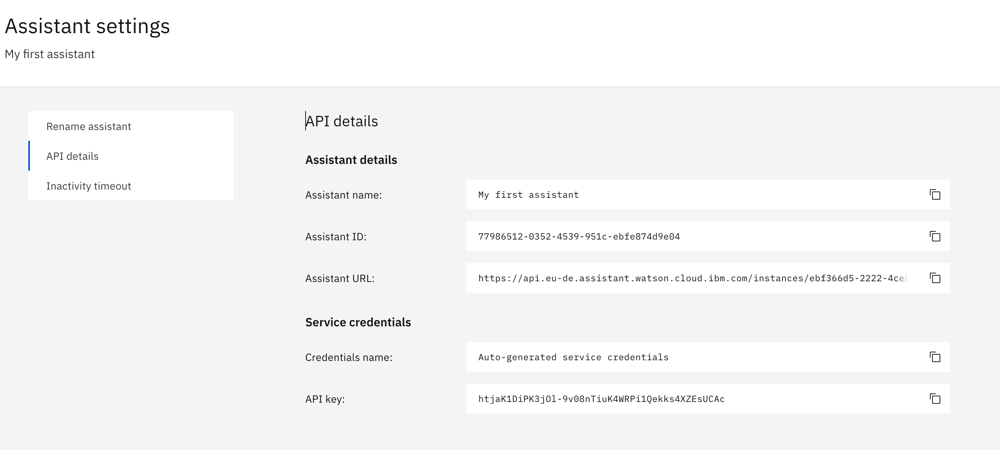

# Lab 3. Multilanguage skill lab

Table of Contents
=================

## 0. Prerequisites
- docker (https://www.docker.com/)
- ngrok (https://ngrok.com/)


## 1. Setup local repository
1.1. clone git repository to your local workstation. Go into the WA-webhooks folder.

``` bash
git clone https://github.com/agavrin/MultilingualAssistant.git
cd MultilingualAssistant/WA-webhooks
```
1.2. Prepare environmental file (env.list) with appropriate URL and APIKEY
``` bash
export WATSON_LANGUAGE_TRANSLATOR_URL="..."
export WATSON_LANGUAGE_TRANSLATOR_APIKEY="..."
echo "WATSON_LANGUAGE_TRANSLATOR_URL=$WATSON_LANGUAGE_TRANSLATOR_URL" > env.list
echo "WATSON_LANGUAGE_TRANSLATOR_APIKEY=$WATSON_LANGUAGE_TRANSLATOR_APIKEY" >> env.list
```

1.3. Run your server as a container
``` bash
docker build -t wa-webhooks .
docker run --env-file env.list -p 8080:8080 -d wa-webhooks
```

1.4. Expose your service externally with ngrok for testing purposes

``` bash
ngrok authtoken MsVyPWqys87623Gwyt97zdRxMmv
ngrok http 8080
```
1.5. Add your service to your WA instance as premessage/postmessage webhook.


## 1. Understand your default region
- Login with your IBM id at https://cloud.ibm.com (if you do not have an id yet, register for free at https://cloud.ibm.com/registration)
- Go to **Manage - Account - Cloud Foundry orgs**
- You should see your default organisation. Click on the actions icon on the right, and select "Spaces":


- You should now see your default region (i.e. **United Kingdom**). Use this region as your default for all next steps below.
Your lite account will **not** allow to create services in multiple regions, unless you apply a promo code to your account requested at https://ibm.biz/ibmcloudcoupon

## 2. Node-red installation

- Follow the steps at https://developer.ibm.com/components/node-red/tutorials/how-to-create-a-node-red-starter-application/ to install node-red in your account (you need to execute **steps 1-5** in the guide). Note that you should use your default region (identified at [step 1](#1-understand-your-default-region)) to install it.

## 3. Watson Services configuration
We will need to have the following services installed:
- IBM Watson Assistant
- IBM Watson Visual Recognition

### 3.1. IBM Watson Assistant
- Download watson pizzeria bot example (right-click at the link and save it as **watson-pizzeria.json**): <a href="https://raw.githubusercontent.com/agavrin/WatsonAssistantEng/master/files/watson-pizzeria.json">watson-pizzeria.json</a>

- Create a new instance or open an existing instance of IBM Watson Assistant service

- Go into your assistant configuration (**Launch Watson Assistant** button) and go to three-buttons menu on the right for your "My first assistant", select Settings, then go to **API Details** - you will see your **Assistant ID** and **API key** -  make a note of those, we will need them later.
Also copy over the **Assistant URL** - the domain part only - i.e. https://api.eu-de.assistant.watson.cloud.ibm.com/ - this will also be needed later.


